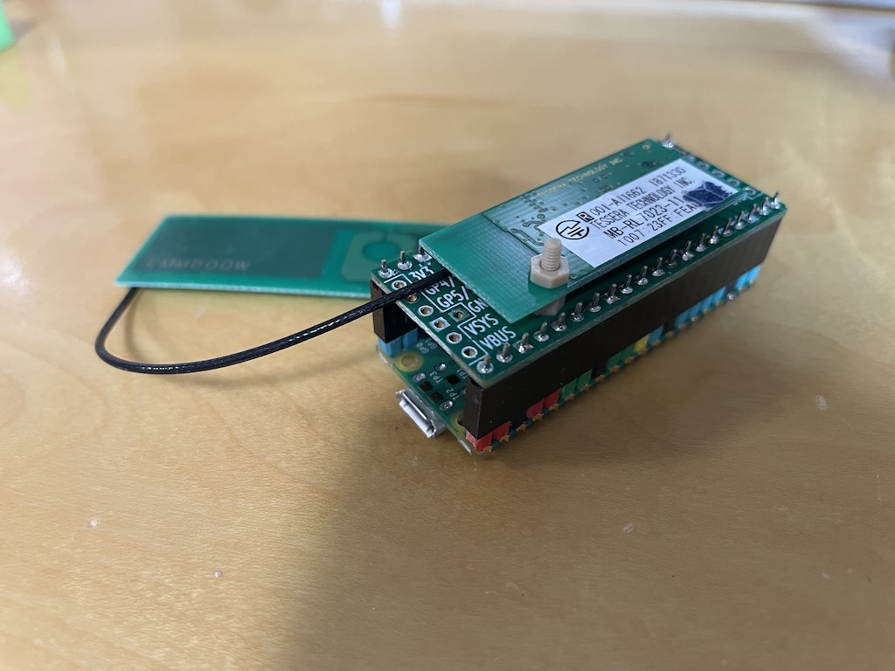
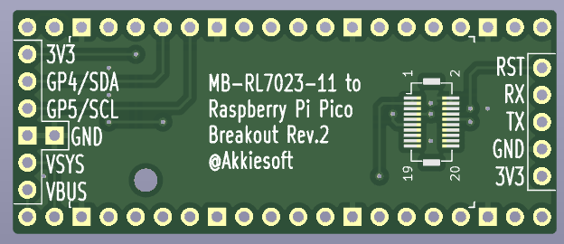
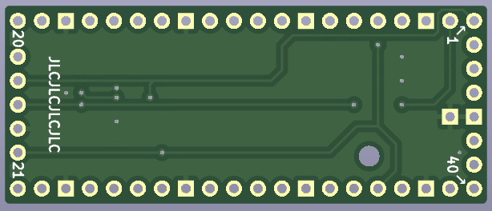

# MB-RL7023-11 for Raspberry Pi Pico

テセラ・テクノロジー社のWi-SUNモジュール「MB-RL7023-11」をRaspberry Pi Picoで使用するプロジェクトです。

Raspberry Pi Picoサイズの変換基板を自作して、CircuitPythonで利用できるようにしました。

[ブログ](https://akkiesoft.hatenablog.jp/entry/20230426/1682512301)

## スクリプトについて

スクリプトは下記の記事などをベースに、Raspberry Pi PicoおよびCircuitPythonで動作するように改変したものです。

* [Pythonでスマートメーターの情報を引っこ抜く - Qiita](https://qiita.com/kanon700/items/d4df13d45c2a9d16b8b0)
* [MB-RL7023-11に対応するために必要な修正箇所](https://twitter.com/yuna_digick/status/1640607967270797312)

### broute_config.py

BルートサービスのID・パスワードや、broute_scan.pyから取得したスマートメーターのパラメーターを記述する設定ファイルです。

デバッグオプションを使用すると、broute_scan.pyやbroute_current_wattage.pyで、シリアル通信の内容を表示できます。

### broute_scan.py

スマートメーターをスキャンして、接続に必要なパラメーターを取得します。

### broute_current_wattage.py

現在使用中の電力をワット数で表示します。取得は10分おきです。

## MB-RL7023-11 to Raspberry Pi Pico Breakoutについて

MB-RL7023-11モジュールが搭載可能なRaspberry Pi Picoサイズの変換基板です。

モジュールの主要なピンはスルーホールに引き出しているため、ピンヘッダーをはんだ付けすると、Pico以外の機器からもUART通信が可能です。

また、Raspberry Pi Picoの5V(VBUS・VSYS)電源、3V3電源、I2C(GP4/GP5)をスルーホールに引き出しているため、ディスプレイなどのモジュールの接続や、電源の入力も可能です。

現状は個人的興味のために製作し、製作した余りを知人に配布している程度のため、頒布等の予定は今のところありません。

## License

MIT License
